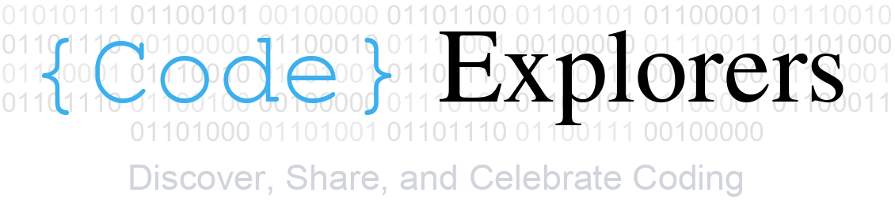

Next Session: March 14, 2024 (Thursday) 12:30 to 13:30 
Speaker: Dr. Nicholas Del Grosso
Zoom registration link: https://us02web.zoom.us/meeting/register/tZUsd--tqTIrH9bXPt5l1_CLqx_v6nE_5Aac

### Organizers
- Anoushka Jain (Ph.D. Student at RWTH Aachen University)
- Sangeetha Nandakumar (iBOTS Code)

### Mission
Build a community that constantly learns new things and shares with the rest!

### Target Audience
- Anyone who wants to know about coding techniques useful in Neuroscience research.
- Everyone!

### Philosophy
- No Code Is Too Small To Share
  - Accumulation of tiny changes in our coding habits can make a huge difference.
  - Even introducing a new library/tool can have a large impact.
- Fun – Need I say more!

### When & Where
- Two Thursdays a month.
- 45-60 minutes during lunch.
- Virtual (Zoom link will be sent out before the session).

### Topics
- Anything related to code.
- Interesting libraries.
- Data processing, storing, handling, visualization, etc.
- No limitations on programming language (R, Python, Matlab, etc.).
- Custom code that you find useful in your work/research.

### Format
- **Code Demonstration (15-20 minutes)**: Jupyter notebooks, Live coding.
- **Discussion (5-10 minutes)**: What did we learn? How can we use it for our work?
- **Topic for Next Session (10-15 minutes)**: What do you want to learn next? Who wants to teach the selected topic?
- **iBOTS Code is available as a learning buddy!**

### Goals
- Byte-sized learning.
  - Quick introduction to new topics and techniques.
- Developing ways of talking about software-related topics.
  - Learning general coding terminologies (including language-specific ones).
- Building a community to meet people with experience in areas we want to learn or teach.
