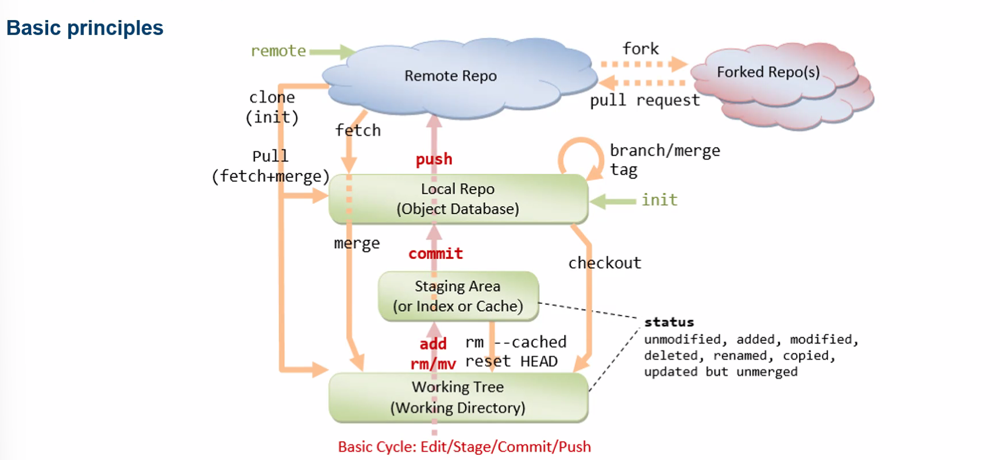
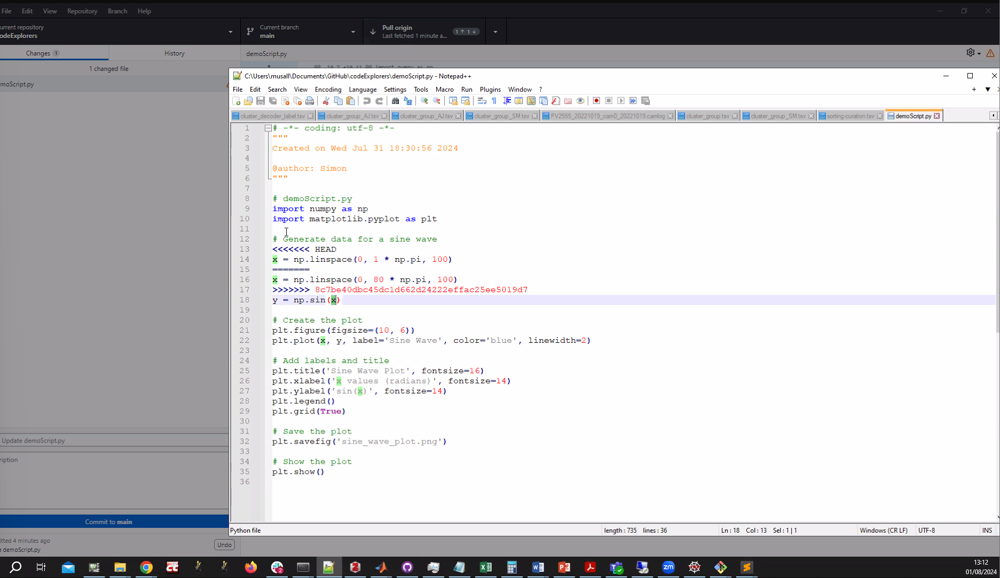
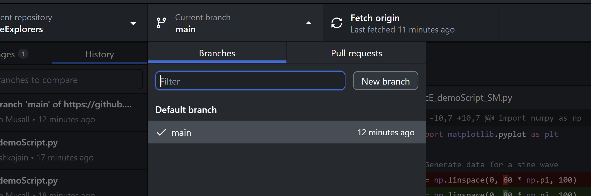
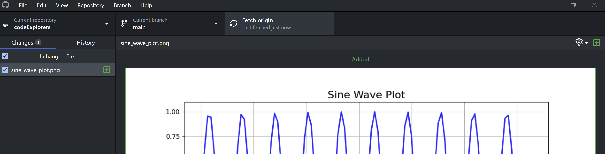
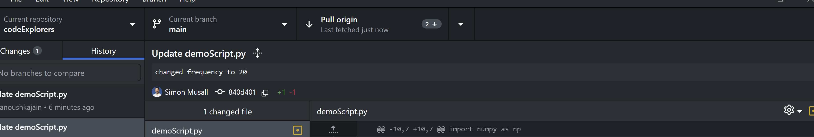

# Using GitHub in Your Own Lab

## What is GitHub?
GitHub is a platform for code hosting, management, sharing, and collaboration. It provides a repository system to collect and store various files of reasonable size, and it incorporates version control to track changes and maintain a history of those changes.

### Key Concepts

- **Repository:** A collection of files and folders.
- **Version Control:** A system for tracking changes and maintaining a history of your code.

## Principles

### Repositories

- **Remote Repository:** The version of your repository stored on GitHub.
- **Local Repository:** A copy of the repository on your local machine.

### Workflow

1. **Editing:** As you make changes on your local machine, your local repository diverges from the remote repository.
2. **Staging:** Add changes to the staging area to track them with Git.
3. **Commit:** Once satisfied with changes, commit them with descriptive notes. This allows you to revert to previous versions if needed.
4. **Push:** Synchronize your local repository with the remote repository by pushing your changes.
5. **Pull:** Update your local repository with changes from the remote repository to avoid conflicts. Pull frequently to keep your local copy up to date.

### Best Practices

- **Public Repositories:** Anyone can view a public repository, so avoid storing sensitive information.
- **Documentation:** Include all necessary information for others to use your repository, typically in a README.md file.
- **Forking:** Create a personal copy of another user's repository to contribute without affecting the original.
- **Merge Conflicts:** Occur when changes conflict between branches. GitHub syntax highlights conflicts as <<<<HEAD >>>>.

### Branching and Issues

- **Branches:** Allow multiple versions of the same repository to exist in parallel.
- **Pull Requests:** Propose changes from one branch to be merged into another.
- **GitHub Issues:** Track tasks, enhancements, and bugs for your projects.

### Important Notes

- **Large Files:** Avoid storing large files in a remote repository as it forces everyone to download them.
- **Pull Before Push:** Always pull before pushing to avoid conflicts.
- **Auto Merge:** Avoid auto merges that undo changes made by others.

## Organizations on GitHub

- **Add Members:** Include collaborators in your GitHub organization.
- **Assign Rights:** Manage permissions and access rights for different members.

## Basic Git Commands

- `git init`: Initialize a new Git repository.
- `git add <files>`: Add files to the staging area.
- `git commit -m "message"`: Commit changes with a message.
- `git pull`: Fetch and merge changes from the remote repository.
- `git push`: Push local changes to the remote repository.
- `git fetch`: Download objects and refs from another repository.

## GitHub Desktop

1. **Interactive Commit History:** Visualize and manage commits.
2. **Clone Repository:** Use the File menu to clone a repository from a URL.

## Simon's Lab Practices

### Trunk-Based Development

1. **Main Branch:** Always work on the main branch and avoid pull requests.
2. **Multiple Repositories:** Use several repositories for different projects.
3. **Playground Folder:** Each user has their own scratch code inside the playground folder.
   - Do not modify others' playground code.
4. **Naming Conventions:**
   - Playground files: `repoabbreviation_script_userinitials` (e.g., `cE_exampleScript_SM`)
   - Main files: `repoabbreviation_script` (e.g., `cE_exampleSinePlot`)

